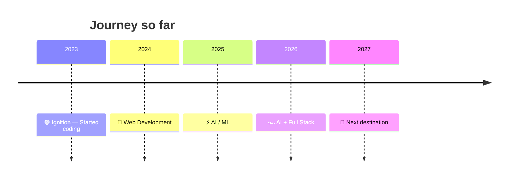

<div align="center">


<a href="https://git.io/typing-svg"></a>

<br>

[](https://github.com/Venkatnama)
[](https://www.linkedin.com/in/nama-venkata-sai11/)
[](https://leetcode.com/u/GB2023003573/)
[](mailto:venkatsainama995@gmail.com)

</div>


## 🔑 IGNITION — DRIVER PROFILE

```text
╔══════════════════════════════════════════════════════════╗
║            RANGE ROVER · VSAI EDITION · v2026            ║
╠══════════════════════════════════════════════════════════╣
║  DRIVER        : Venkata Sai                             ║
║  TRIM          : AI / ML + FULL STACK                    ║
║  ENGINE        : Python + JavaScript          (V8 🔥)    ║
║  DRIVETRAIN    : React + Node.js              (AWD)      ║
║  TERRAIN MODE  : MongoDB + REST APIs          (ALL)      ║
║  FUEL          : Coffee + Curiosity ☕                   ║
║  STATUS        : 🟢 BUILDING — ENGINE RUNNING            ║
╚══════════════════════════════════════════════════════════╝
```


## 🛣️ THE GARAGE — CURRENT BUILDS

<table>
<tr>
<td width="50%" valign="top">

### 🚛 FleetXpress
**Fleet Tracking Platform**

`MEAN Stack` `MongoDB` `Express` `Angular` `Node.js`

> Real-time fleet management and tracking platform.

**FUEL TANK** &nbsp;`████████░░ 80%`

</td>
<td width="50%" valign="top">

### 🌱 AgriAI
**Agriculture LLM Assistant**

`LLM` `RAG` `Python` `Computer Vision`

> AI assistance for vegetable crop cultivation and disease detection.

**FUEL TANK** &nbsp;`███████░░░ 70%`

</td>
</tr>
<tr>
<td width="50%" valign="top">

### 🛡️ Insider Threat BI
**Behavioral Intelligence System**

`Python` `ML` `UEBA` `Risk Analytics`

> Detecting abnormal user behavior and generating security risk scores.

**FUEL TANK** &nbsp;`█████████░ 90%`

</td>
<td width="50%" valign="top">

### 👁️ WakeLens
**Driver Drowsiness Detection**

`Computer Vision` `OpenCV` `AI/ML`

> Detecting driver fatigue through eye-blink analysis. *(Fitting, since the driver never sleeps.)*

**FUEL TANK** &nbsp;`██████░░░░ 60%`

</td>
</tr>
</table>


## ⚙️ UNDER THE BONNET — ENGINE SPECS

<div align="center">

| 🔩 SYSTEM | 🏎️ TECHNOLOGY |
|:---:|:---:|
| 🧠 AI / ML | Python • PyTorch • TensorFlow • Scikit-Learn |
| 👁️ Computer Vision | OpenCV • YOLO |
| 🤖 LLM | LangChain • RAG • OpenAI |
| 🎨 Frontend | HTML • CSS • JavaScript • React |
| ⚡ Backend | Node.js • Express |
| 🗄️ Database | MongoDB • MongoDB Atlas |
| ☁️ DevOps | Docker • GitHub • CI/CD |
| 🔧 Tools | Git • GitHub • VS Code |

</div>


## 🏁 TACHOMETER — SKILL TELEMETRY

```text
                      REDLINE  ▸▸▸  100%

PYTHON           ██████████████████░░   90%  ▲ 
JAVASCRIPT       ████████████████░░░░   80%
AI / ML          ████████████████░░░░   80%
REACT            ██████████████░░░░░░   70%
NODE.JS          ██████████████░░░░░░   70%
COMPUTER VISION  ██████████████░░░░░░   70%
LLM / RAG        ████████████░░░░░░░░   60%
MLOps            ██████████░░░░░░░░░░   50%  ◂ tuning
```


## 🔧 PIT STOP — NOW UPGRADING

```text
┌────────────────────────────────────────────────┐
│  🧠 Advanced AI / ML        ███████████████░░░ │
│  🤖 LLM Engineering         █████████████░░░░░ │
│  ⚙️  MLOps                   ██████████░░░░░░░░ │
│  ☁️  Cloud & Deployment      ████████░░░░░░░░░░ │
└────────────────────────────────────────────────┘
```

**Planned modifications:** Full-Stack • ML • Computer Vision • LLM Apps • RAG • REST APIs • Advanced MLOps • Cloud Engineering • System Design

> *Pit crew currently upgrading the engine...*


## 🗺️ ROUTE MAP — RACE HISTORY



### 🏆 Trophy Cabinet

- 🏁 Infosys Springboard Internship
- 🤖 AI/ML Projects
- 💻 Full-Stack Development
- 🧑‍💻 GitHub Community Core Team (Tech Lead)
- 📚 IBM Full Stack Web Developer Certification
- 🏆 Hackathons & Technical Events
- 🔬 AI-powered Agriculture Research


## 🚨 DASHBOARD — WARNING LIGHTS

<div align="center">

| SYSTEM | STATUS |
|:---|:---:|
| 🧠 AI Engine | 🟢 ONLINE |
| ⚡ API Layer | 🟢 ONLINE |
| 🗄️ Database | 🟢 ONLINE |
| 🐳 Containers | 🟡 TUNING |
| ☁️ Cloud | 🟡 UPGRADING |
| ☕ Coffee | 🔴 LOW FUEL — REFILL NEEDED |

</div>


## 🏎️ LEETCODE — LAP TIMES

<div align="center">

<a href="https://leetcode.com/u/GB2023003573/">

</a>

*Every solved problem is another lap on the circuit.*

</div>


## 🛞 CONTRIBUTION ROAD

<div align="center">

```text
LESS TALK.  MORE BUILDS.  MORE COMMITS.  MORE MILEAGE.
```


</div>


## 📡 RADIO — LET'S CONNECT

<div align="center">

**Have an idea? Building something crazy?**

### Let's take it off-road. 🏔️

[](https://www.linkedin.com/in/nama-venkata-sai11/)
[](https://github.com/Venkatnama)
[](https://leetcode.com/u/GB2023003573/)
[](mailto:venkatsainama995@gmail.com)

```text
╔════════════════════════════════════════════╗
║        VSAI                                ║
║        ENGINEERED FOR PERFORMANCE          ║
║                                            ║
╚════════════════════════════════════════════╝
```

### `BUILD • BREAK • FIX • REPEAT`


</div>
